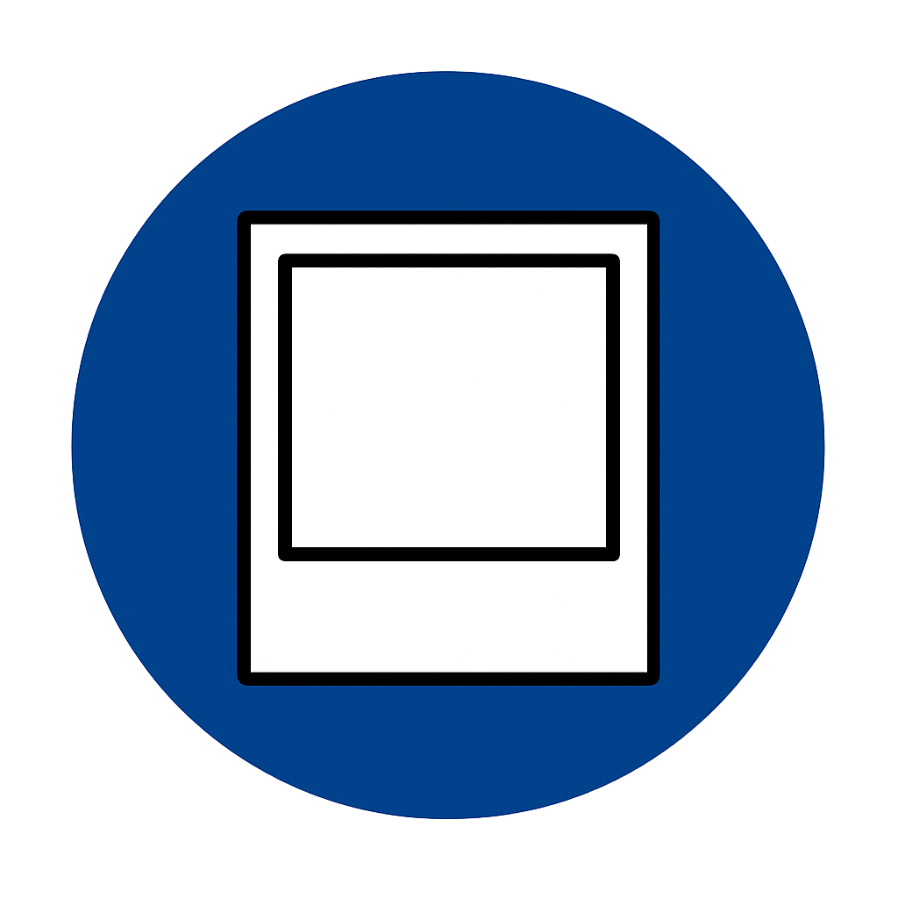
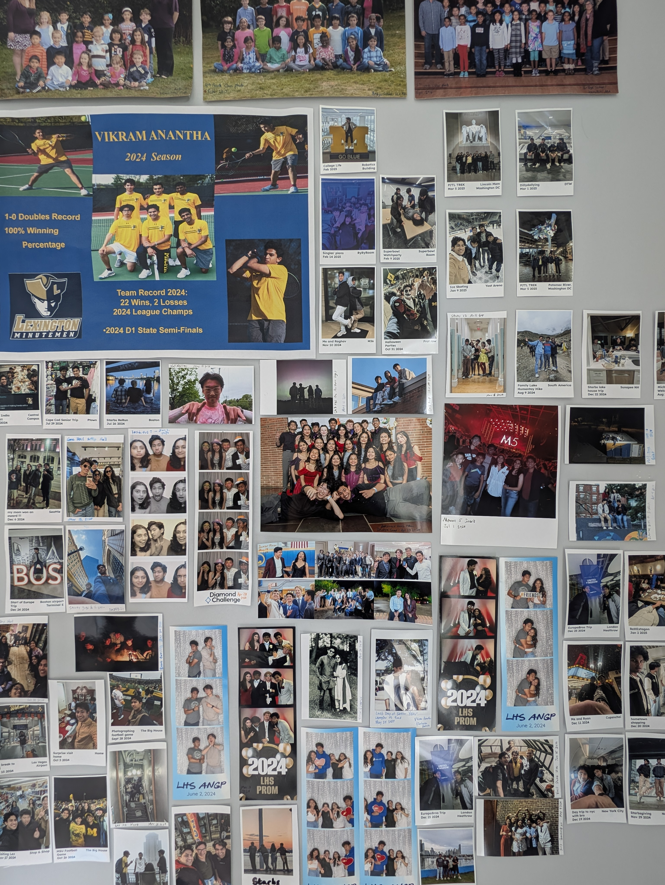
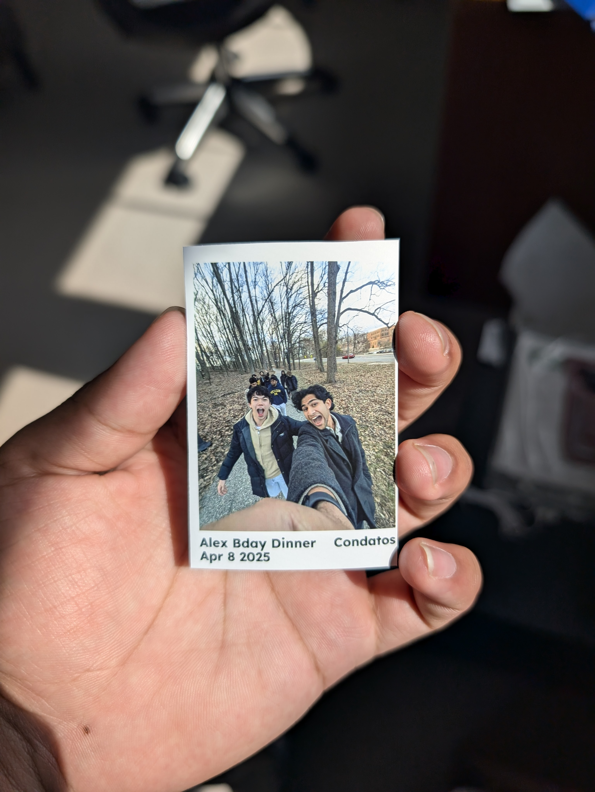

# The Polaroider
Vikram Anantha - May 2025


## Why

I like taking photos. Recently I've started to like printing some of my photos out as if they're polaroids and sticking on my wall, for memerobelia.



This is an example of a polaroid created with this tool. The original image is transformed into a polaroid-style photo with space for captions about what, when, and where the photo was taken.

The problem is that I don't take polaroid pictures, I take normal pictures and want to turn them into polaroids.

This isn't a hard process. But it can be automated.

This does that.

## Running the code

The code runs in this format:
```
python main.py <input_image_name> <what> <when> <where>
```

For example,
```
python main.py \
    alex_bday.jpg \
    "Alex Bday Dinner" \
    "Apr 8 2025" \
    "Condatos"
```

## Some features

The upper left text (the WHAT) cant go beyond the mid-vertical-line of the polaroid, otherwise it will wrap to the next line, pushing the bottom left text (the WHEN) down one line. Same for the upper right text (the WHERE). 

In the future, I'm gonna try to make it work for not just vertical images, but square images as well (so the text is moved up, and then when you print it you just cut off the bottom white space).

## Assumptions & Requirements

This code requires that the source image is in `pictures/` and will output the polaroid in `polaroid/`. Alex's birthday example is done as such.

It also requires that you have the Lexend Deca font, but you can download that [here](https://fonts.google.com/selection)

You also need the Python library Pillow, which you can install with 
```
pip install pillow
```

## End Result

Once you generate your polaroids, just print them out at Walgreens with the 2x3 wallet prints, and stick it onto your wall. At least, that's whaat I did.

